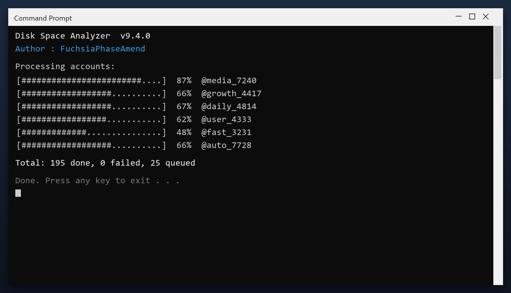

# Disk Space Analyzer — Latest Version Free Download (2026)

 

**Disk space analyzer** is a Windows utility that keeps your PC clean and running fast. It is the current 2026 build, tested on Windows 10 and 11. **Free. No registration. No bundled adware.**

| | |
| --- | --- |
| **Program** | Disk Space Analyzer |
| **Version** | Latest 2026 build |
| **Price** | Free |
| **Systems** | see requirements below |
| **Download** | Quick Start section below |

  

## Before You Start

- Start with a quick scan before a deep scan
- Deep scans take longer but find more
- Check free space before and after
- Note any errors and check the FAQ
- Repeat monthly for consistent speed

## Requirements

| **Component** | **Minimum** | **Recommended** |
| --- | --- | --- |
| **OS** | Windows 10 | Windows 11 (64-bit) |
| **RAM** | 2 GB | 4 GB |
| **Disk** | 100 MB free | 500 MB free |
| **Network** | For download | For updates |

## Install

1. **Download** the file below
2. **Run** the installer and follow the steps
3. **Open** the tool and press Scan
4. **Review** what it found
5. **Apply** the fixes - a restore point is created first

  

> **Note:** if nothing happens when you click, run the file as administrator. Windows sometimes blocks new programs until you allow them.

## What It Does

Disk space analyzer is a maintenance tool for Windows. It scans your system for problems such as leftover files and invalid registry entries, then removes or repairs them. Everything happens locally on your PC - nothing is uploaded anywhere.

| **Term** | **Meaning** |
| --- | --- |
| **Registry** | The Windows database of settings |
| **Junk files** | Temporary files left behind by programs |
| **Startup items** | Programs that launch with Windows |
| **Optimize** | Make the system run faster |

## Features

| **Feature** | **Details** |
| --- | --- |
| **Size** | Small download, quick install |
| **Scan speed** | Typically under 3 minutes |
| **Background use** | None when closed |
| **Ads** | None |
| **Bundled extras** | None |
| **Offline** | Works without internet |

## Problems and Fixes

| **Issue** | **Fix** |
| --- | --- |
| **Windows warns about the file** | Click More info, then Run anyway |
| **Slow first launch** | Normal - it indexes on first run |
| **Scan finds nothing** | Good - your PC is already clean |
| **Settings do not save** | Run as admin once so it can write config |

## FAQ

**Will it speed up my games?**

It can help by freeing RAM and stopping background tasks, but it is not a game booster.

**Does it delete my downloads?**

No. It only removes temporary and leftover data, never your own files.

**Can I schedule it?**

Yes, you can set it to run weekly automatically.

**What if I do not like it?**

Uninstall it normally from Windows Settings - it leaves nothing behind.

---

*galactic-heron-795 · Updated 2026-10-09 · Shared under the MIT License*
